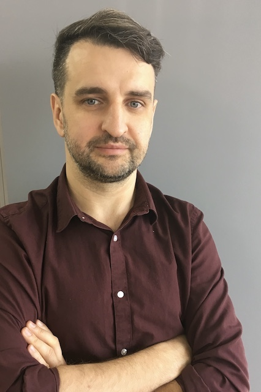

# Zhuravskii Denis Vladimirovich

 DENIS ZHURAVSKII           | Professional experience 
 ---------------------------|:-------------------------|
Position                    | Design Engineer           
Duties                      | Development, 3d modeling and preparation of technical documentation for basic parts the stator of turbogenerators. Author's supervision over the manufacture.
Key skills and competences  | Cad systems: AutoCad, Unigraphics NX, Office (Word, Excel)
Learning                    | I am taking the Java developer course at the [**Netology**](https://netology.ru). Completed the basics of Java and object-oriented programming. Completed the Git course.
GitHub                        | [GitHub](https://github.com/viago2k20)
Replit                        | [Replit](https://replit.com/@viago2k20)
Hobbies and interests       | Swing Dance teacher (Lindy Hop, Balboa), music, travel
tel.                        | +7 961 805-34-39
email                       | denzh@mail.ru
